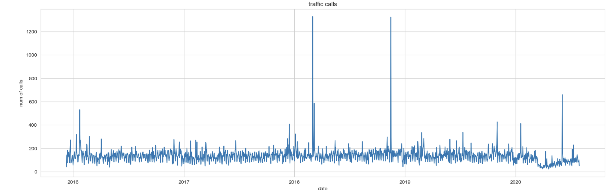
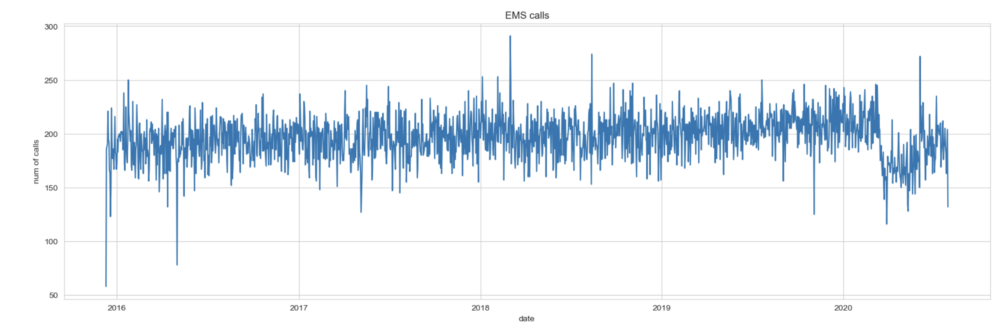
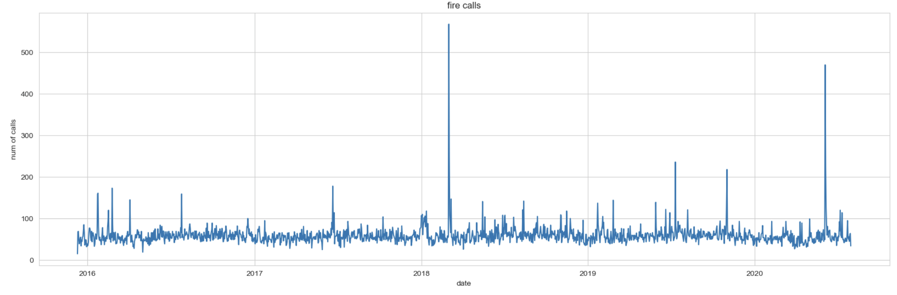
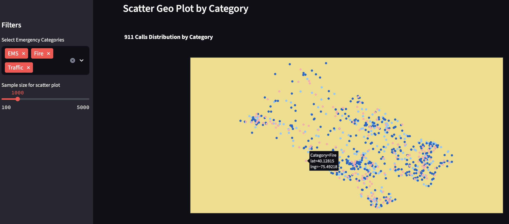

# Emergency-911-Calls Analysis & Dashboard

This project analyzes 911 emergency call data to uncover patterns in call volume, location, and emergency types. 
It also features an interactive Streamlit dashboard for real-time filtering, geospatial visualization, and trend analysis.

---

## Dataset

The dataset is from Kaggle and includes emergency call records from Montgomery County, PA.

- Key columns: `lat`, `lng`, `title`, `timeStamp`, `zip`, `twp`, `desc`
- Over 500,000 call records
- Covers categories like EMS, Fire, and Traffic

---

###  Sample EDA Visuals
Number of traffic related calls by date :

Number of EMS related calls by date :

Number of fire related calls by date :

---

## Geospatial Mapping

Used Folium to generate interactive heatmaps of call density:

- Location plotted using `lat` and `lng`
- Call intensity visualized using color gradients

---

## Streamlit Dashboard Features

Built an interactive dashboard  using Streamlit.

Dashboard Preview:

